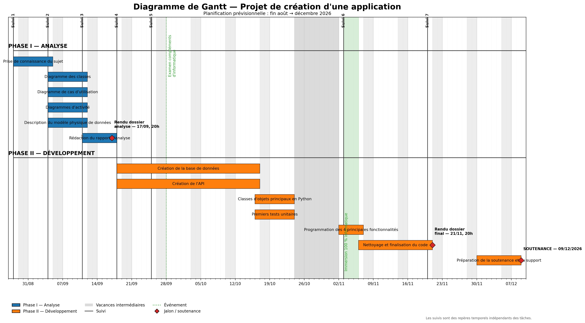
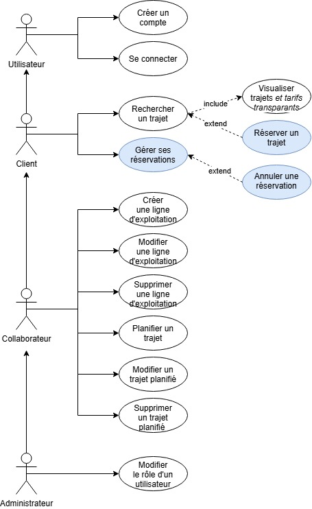
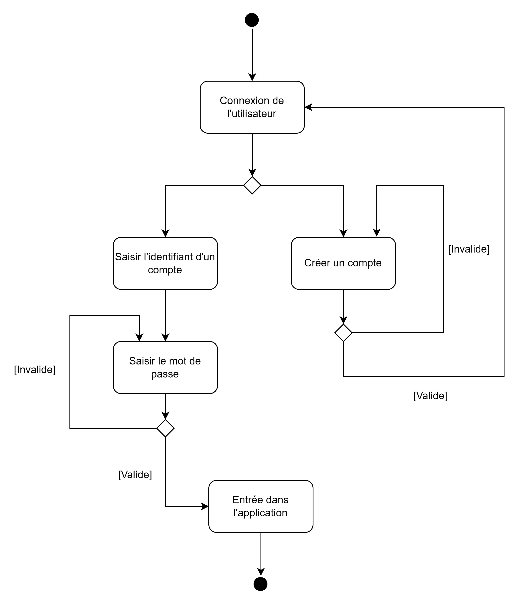
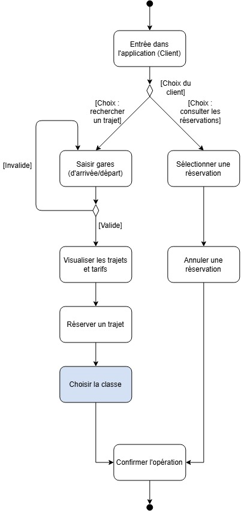
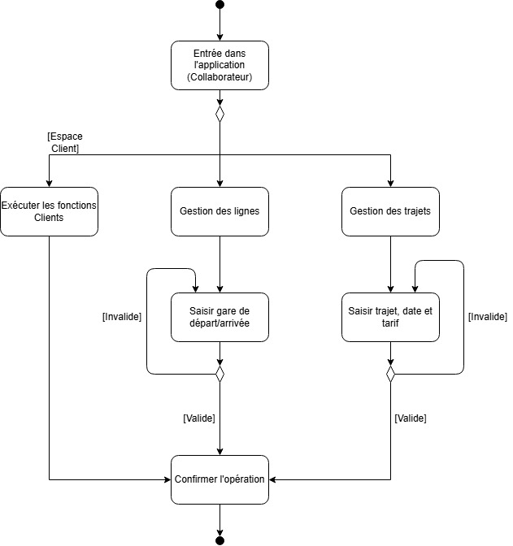
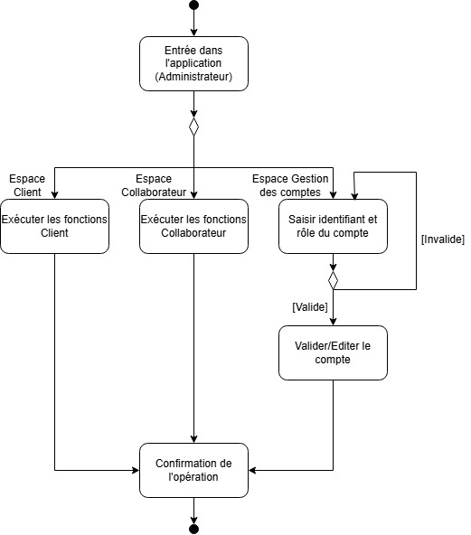
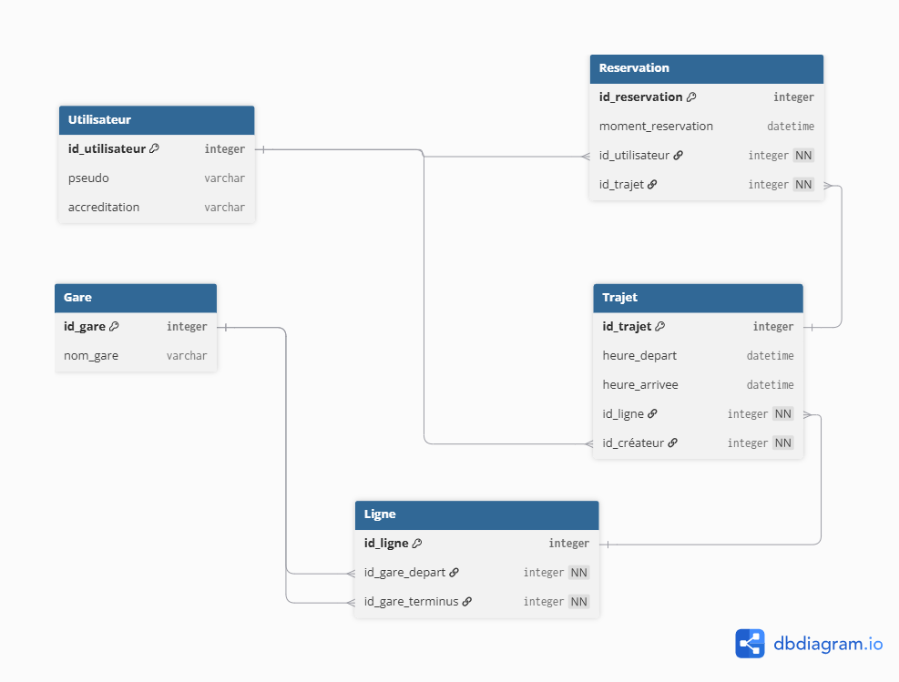

--- 
citeproc: false
nocite: "@*"
format:
  html:
    code-tools: true
  typst:
    papersize: a4
    margin:
      x: 1.5cm
      y: 2.0cm
    section-numbering: 1.1.a
    mainfont: "Libertinus Serif"
    fontsize: 11pt
---


```{=typst}
#import "model.typ": project_template

#show: body => project_template(
  title: [Trajecto],
  team: [Équipe 10],
  authors: ([Benjamin Blanc], [Manon Duquesne], [Hugo Lhommeau], [Jérémie L'Hostis], [Alexandre Yu]),
  tutor: [Kévin Leroy],
  project: [Projet Informatique de 2ème année - Année 2026-2027],
  body
)
```

## Introduction {.unnumbered}

```{=typst} 
Et si chacune et chacun pouvait imaginer sa propre manière de voyager en train ? C'est autour de cette idée que s'articule *Trajecto*, une plateforme destinée à proposer, gérer et rechercher des trajets ferroviaires en s'appuyant sur les données du réseau SNCF.

L'objectif de notre application est de fournir une plateforme permettant à une entreprise ferroviaire de gérer son offre de transport et à ses clients de rechercher facilement les trajets disponibles. L’interface graphique étant prise en charge par les webmasters de l’entreprise, notre travail se concentre sur la conception et le développement d’une API robuste, sécurisée et exploitable par différents clients.

L'application s'articule principalement autour de quatre fonctionnalités : de la gestion des comptes utilisateurs, à trois niveaux d'habilitation différents, à la recherche de trajets précis, en passant par l'organisation des lignes d'exploitation.

En complément de ces fonctionnalités essentielles, nous étudierons un positionnement commercial propre à notre entreprise afin de proposer une expérience différente de celle du réseau ferroviaire traditionnel. Cette fonctionnalité pourra notamment s'appuyer sur une meilleure transparence des informations proposées au client, par exemple en détaillant la composition du prix d'un trajet.


Ce rapport d'analyse intermédiaire présente ainsi les choix effectués pour répondre à ces besoins. Nous y décrirons le fonctionnement général de l'application, les différents acteurs et leurs interactions avec l'API, la structure des données ainsi que les principaux choix d'implémentation envisagés. L'objectif est de disposer, à l'issue de cette phase, d'une vision suffisamment précise du système pour pouvoir passer au développement de l'application dans de bonnes conditions.
```



## Planning

Voici le planning prévisionnel de la réalisation de ce projet, sous forme classique de diagramme de Gantt, incluant les tâches déjà effectuées et les échéances qui guiderons notre organisation au cours des tâches futures :

{fig-align="center" width="120%"}

### Phase d'analyse

La première phase du projet, qui a duré trois semaines environ, a consisté à prendre connaissance des consignes exactes et ce qu'elles impliquaient en termes de choix technologiques. À ce titre, les premiers travaux pratiques, ayant eu lieu en parallèle de façon hebdomadaire, ont été une aide précieuse à la compréhension du sujet, même s'il nous reste à ce jour des réflexions à achever, des points à préciser et des décisions à prendre (voir notamment la section sur le diagramme de classes à ce sujet).

Nous en avons profité pour faire connaissance et pour répartir les tâches indiquées sur la première semaine selon nos appétences connaissances respectives. Le diagramme des classes, plus complexe, a cependant occupé plusieurs d'entre nous, de même que la rédaction du présent rapport.

Cette phase avait donc pour but principal de cibler nos objectifs de travail et d'assimiler les connaissances informatiques idoines : notions de couches, services, l'ensemble concepts liés aux bases de données, et le fonctionnement de l'API SNCF, nécessaire pour récupérer les données nous permettant, à terme, de gérer les lignes d'exploitation de Trajecto.

Bien entendu, cette phase a aussi servi à organiser le groupe et à effectuer une projection dans le temps des tâches futures; c'est-à-dire celles de la phase de développement.

### Phase de développement

Cette seconde phase, qui durera deux mois et demie, s'articulera en trois temps.

- *Initialisation* : Entre le rendu du présent rapport et le congé de la Toussaint, cinq semaines s'écouleront. Cette période contient également les deux derniers travaux pratiques, qui se concentreront sur l'expérience utilisateur. Elle contient enfin l'examen de "Compléments d'informatique", l'UE associée au projet. Par conséquent, nous mobiliserons toute la durée pour parfaire nos connaissances nécessaires à la programmation des fonctionnalités et faire deux choses importantes : créer la base de données de notre application (et son s'assurer de la cohérence de sa structure), et de créer les composants les plus fondamentaux de notre API, comme la création de compte utilisateur par exemple. La dernière semaine sera consacrée à toutes les classes de la couche objet "business_object" et aux tests unitaires dédiés auxdits objets : elle nous permettra de nous rendre compte des éventuelles corrections à apporter à notre modélisation.

- *Programmation* : À la rentrée de novembre, trois jours serons consacrés à une immersion totale dans le projet. Cette période dense, dont l'organisation précise reste à définir, servira à programmer la majorité des quatre fonctionnalités (selon notre efficacité, peut-être la cinquième) que nous présentons dans la section @sec-fonc. À son issue, notre application devra être, sinon totalement, du moins partiellement prête à l'usage. 

- *Finalisation* : Pendant les deux semaines qui suivront, il s'agira en parallèle de corriger les bugs, finaliser les quelques algorithmes manquants, et rédiger le rapport final. Enfin, trois semaines resteront et permettront de préparer la présentation orale de notre application en complément du rapport. Ce sera éventuellement l'occasion de créer une frontend attractive, quelques fonctionnalités facultatives, et de générer des exemples d'utilisation convaincants.



## Fonctionnalités principales {#sec-fonc}

### Gestion des comptes utilisateur

#### Description {.unlisted}

Permettre aux utilisateurs de créer et gérer leur compte. Chaque compte possède un nom d’utilisateur, un mot de passe et un niveau d’habilitation parmi CLIENT, COLLABORATEUR et ADMIN. Les comptes ADMIN peuvent modifier le niveau d’habilitation des autres utilisateurs, à l’exception des autres comptes ADMIN.

#### Fonctionnement {.unlisted}

Lors de la création d’un compte, l’utilisateur renseigne un nom d’utilisateur et un mot de passe. Le compte est associé à un niveau d’habilitation CLIENT.

Un compte ADMIN peut consulter les comptes utilisateurs et augmenter ou diminuer leur niveau d’habilitation. Un ADMIN ne peut cependant pas modifier le niveau d’un autre ADMIN.

Un compte est associé à un identifiant unique, qui est utilisé pour identifier le compte dans la base de données.

Un ADMIN ne peut pas modifier le niveau d’habilitation d’un autre ADMIN.

Un utilisateur non ADMIN ne peut pas modifier les habilitations des autres comptes.

( Le mot de passe doit être stocké de manière sécurisée et ne doit jamais être enregistré en clair. )


#### Prérequis {.unlisted}

- Nom d’utilisateur
- Mot de passe
- Niveau d’habilitation lors de la création ou de la modification
- Identifiant du compte à modifier pour un ADMIN

#### Tâches effectuées {.unlisted}

- Création d’un nouveau compte utilisateur
- Connexion à un compte existant
- Modification du niveau d’habilitation d’un utilisateur
- Affichage d’un message de confirmation ou d’erreur en cas d’échec


#### Exemple {.unlisted}

Un utilisateur crée un compte avec le nom alice et un mot de passe. Son compte est créé avec le rôle CLIENT. Un ADMIN peut ensuite faire évoluer son rôle en COLLABORATEUR. L’ADMIN ne peut toutefois pas modifier le rôle d’un autre compte ayant déjà le niveau ADMIN.

---

###  Gestion des lignes d’exploitation

#### Description {.unlisted}
Permettre à un compte COLLABORATEUR de créer, modifier et supprimer des lignes d’exploitation reliant une gare de départ à une gare de terminus. Les gares utilisées sont récupérées à partir de l’API SNCF afin de garantir leur existence.

#### Fonctionnement {.unlisted}

Lors de la création ou de la modification d’une ligne, le collaborateur recherche les gares grâce à une fonctionnalité d’autocomplétion. Les résultats proposés proviennent de l’API SNCF.

Le collaborateur sélectionne une gare de départ et une gare de terminus parmi les gares existantes, puis enregistre la ligne d’exploitation.

Les deux gares doivent exister dans les données fournies par l’API SNCF.

Une ligne ne peut pas être créée si la gare de départ et la gare de terminus sont identiques.

Un compte CLIENT ne peut pas gérer les lignes d’exploitation, sauf évolution ultérieure des droits.

La suppression d’une ligne peut être refusée si des trajets sont déjà planifiés sur cette ligne, afin de préserver l’intégrité des données.


#### Prérequis {.unlisted}

- Gare de départ
- Gare de terminus
- Compte utilisateur disposant du rôle COLLABORATEUR

#### Tâches effectuées {.unlisted}

- Création d’une nouvelle ligne d’exploitation
- Modification d’une ligne existante
- Suppression d’une ligne
- Affichage d’un message de confirmation ou d’erreur en cas d’échec

#### Exemple {.unlisted}

Un collaborateur saisit "Rennes" dans le champs de départ. L’application propose notamment "Rennes" grâce à l’API SNCF. Il sélectionne Rennes comme gare de départ et Paris comme gare de terminus, puis crée la ligne Rennes → Paris.

---

### Gestion des trajets proposés

#### Description {.unlisted}
Permettre à un compte COLLABORATEUR de planifier des trajets sur une ligne d’exploitation existante. Un trajet est défini notamment par une date et une heure de départ, un nombre de places disponibles et un tarif. Le temps de trajet est automatiquement déterminé à partir de l’API SNCF.

#### Fonctionnement {.unlisted}

Le collaborateur sélectionne une ligne d’exploitation existante, puis renseigne la date et l’heure de départ, le nombre de places et le tarif.

L’application interroge l’API SNCF afin de vérifier qu’un trajet en train est possible entre la gare de départ et le terminus. Elle récupère également les informations nécessaires au calcul automatique du temps de trajet.

Le collaborateur peut ensuite modifier ou supprimer le trajet planifié.


La ligne d’exploitation doit exister avant de pouvoir planifier un trajet.

Le trajet doit être réalisable en train selon les informations fournies par l’API SNCF.

Le temps de trajet ne doit pas être saisi manuellement par le collaborateur.

La date et l’heure de départ doivent être valides.

Le nombre de places doit être supérieur à zéro.

Le tarif doit être positif ou nul selon les règles commerciales retenues.

Un trajet ne peut pas être planifié si l’API SNCF ne permet pas de vérifier sa faisabilité.

#### Prérequis {.unlisted}

- Ligne d’exploitation
- Date de départ
- Heure de départ
- Nombre de places
- Tarif
- Compte utilisateur disposant du rôle COLLABORATEUR

#### Tâches effectuées {.unlisted}

- Création d’un trajet planifié
- Temps de trajet calculé automatiquement
- Modification ou suppression d’un trajet
- Confirmation ou message d’erreur


#### Exemple {.unlisted}

Un collaborateur sélectionne la ligne Rennes → Paris, choisit le 15 octobre à 08h00, indique 50 places disponibles et un tarif de 45 €. L’API SNCF confirme qu’un trajet est possible et permet à l’application de calculer automatiquement sa durée.

---

### Recherche d’un trajet

#### Description {.unlisted}
Permettre à un compte CLIENT de rechercher les trajets proposés entre une gare de départ et une gare d’arrivée. Une autocomplétion facilite la sélection des gares.

#### Fonctionnement {.unlisted}

Le client saisit une gare de départ et une gare d’arrivée. L’application propose automatiquement des gares correspondant à la saisie grâce aux données issues de l’API SNCF.

Après validation de la recherche, l’application affiche les trajets proposés correspondant aux critères renseignés.

Pour chaque trajet, le client peut consulter la gare de départ, la gare d’arrivée, la date et l’heure de départ ainsi que le temps de trajet.

Les gares doivent correspondre à des gares existantes.

La gare de départ et la gare d’arrivée doivent être différentes.

Si aucun trajet ne correspond à la recherche, un message explicite est affiché.

Une recherche peut retourner plusieurs trajets pour une même liaison.

#### Prérequis {.unlisted}

- Gare de départ
- Gare d’arrivée
- Compte utilisateur disposant du rôle CLIENT

#### Tâches effectuées {.unlisted}

Renvoie une liste de trajets correspondant aux gares recherchées, comprenant au minimum :
- Gare de départ
- Gare d’arrivée
- Date de départ
- Heure de départ
- Temps de trajet


#### Exemple {.unlisted}

Un client sélectionne Rennes comme gare de départ et Paris comme gare d’arrivée. L’application affiche les trajets disponibles entre ces deux gares avec leur date, leur heure de départ et leur durée.

---

###  Positionnement commercial

#### Description {.unlisted}
Proposer une fonctionnalité permettant de différencier le service du réseau commercial de la SNCF en offrant au client une tarification transparente.
Cette fonctionnalité ne sera implémentée que si le temps le permet: nous n'allons pas l'explorer dans ce rapport pour l'heure.

---

## Modélisation

### Architecture générale

<!--{fig-align="center"}-->

#### Base de données :  {.unlisted}

Pour stocker les données, nous allons utiliser une base de données postgreSQL, sur l’environnement du datalab de l’ENSAI. La base de données contiendra les informations utilisateurs, ainsi que les gares, les lignes de train et les trajets prévus. Ces données seront saisies petit à petit. Ainsi, les collaborateurs écriront dans la base de données lorsqu’ils créeront un nouveau trajet, ou lorsqu’une nouvelle ligne sera créée.

#### API :  {.unlisted}

Nous allons aussi récupérer des données via l’API de la SNCF, Navitia. Navitia est une API qui fonctionne par requêtes HTTP GET. Une requête HTTP GET est une demande envoyée à un serveur pour récupérer des informations à partir d’une URL. En envoyant cette requête, l’API demande une clé d’authentification, qui est disponible gratuitement avec une limite de 1500 appels par jour, et dont nous avons fait la demande au préalable. L’API renvoie ensuite une réponse HTTP contenant les données demandées au format JSON. Dans le cadre de notre projet, nous utiliserons l’API pour deux principales raisons :

-Récupérer les gares existantes 
-Récupérer les temps de trajet existants sur une ligne.

#### DAO :  {.unlisted}
 
Les DAO, pour Data Access Object, vont nous permettre de faire le lien entre les classes métier et la base de données. Leur rôle est de gérer l'accès aux données sans que les classes métier aient besoin de connaître le fonctionnement de la base de données.
Ils permettent notamment, via des requêtes SQL, d'enregistrer les objets créés par les collaborateurs (gares, trajets, utilisateurs, etc.) dans la base de données afin de les sauvegarder. Ils permettent également de récupérer les données de la base de données et de les transformer en objets Python utilisables par le reste de l'application. 

### Diagrammes des cas d’utilisation

{fig-align="center" width="50%"}

### Diagrammes d’activité

#### Utilisateur de base {.unlisted}

{fig-align="center" width="50%"}

#### Client {.unlisted}

{fig-align="center" width="50%"}

#### Collaborateur {.unlisted}

{fig-align="center" width="50%"}

#### Administrateur {.unlisted}

{fig-align="center" width="50%"}

### Diagramme de classes

.jpg){fig-align="center" width="110%"}

#### Couche objet {.unlisted}


<!-- Mentionner dans un paragraphe le dilemme concernant l'héritage et la décision de mentionner les niveaux d'habilitation par énumération. -->
<!-- Sinon problème de destruction d'objets (on ne change jamais de classe) et de mémoire (trajets réservés ?) -->
<!-- Est-ce contradictoire avec le diagramme de cas d'utilisation ? Peut-être pas -->
<!-- Gestion de l'affichage ? -->

#### Couche service {.unlisted}

#### Couche DAO {.unlisted}

### Modèle de base de données

{fig-align="center" width="100%"}